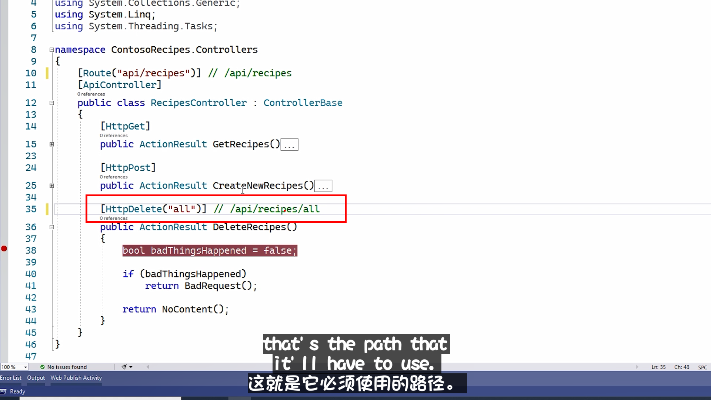

# API 概述

API 一般都是使用 `Controller` 实现
如果我们要发出 API 请求，访问我们想要使用的特定资源。
这就是 URL 发挥作用的地方。

URL 本质上是我们 API 的地址。

> 如图, 此处的 `[HttpDelete]("all")` 指示了如果要调用此方法(API),
> 那么就在 URL 的地址为 /api/recipes/all


或者是我们想删除具有特定 `id` 的资源
那么就可以使用

```csharp
[HttpGet("{id}")]
public async Task<IActionResult> ActionName(string id)
{
    return NotContent();
}
```

asp.net Core 会自动完成匹配这些名称的工作, 确保数据, 被传递到操作方法中。
