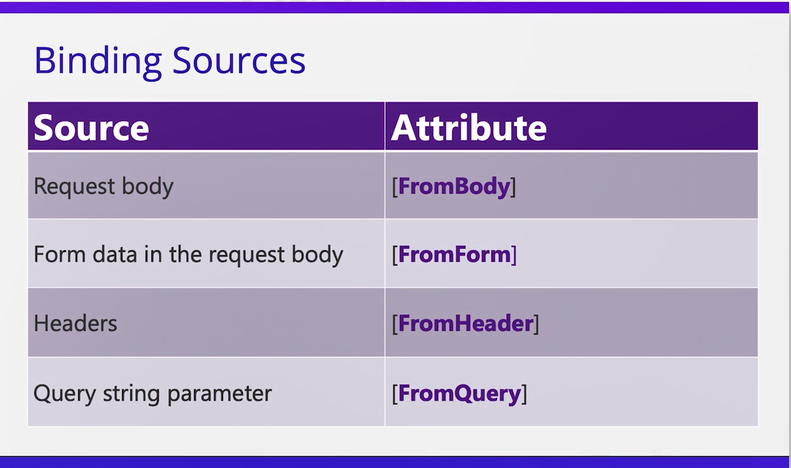

# Request属性

ASP.NET Core 定义了很多我们可以用来检查传入请求的类型和属性

> [!NOTE]
>
> 我们甚至可以定义想从请求中提取的信息的 **类型**, 并将其作为 **参数** 提供给我们的操作方法。

这个过程通常被称为**绑定**。

> [!TIP]
>
> 我们可以从中获取信息的请求有很多不同的部分, 如下图：

## Binding Sources

