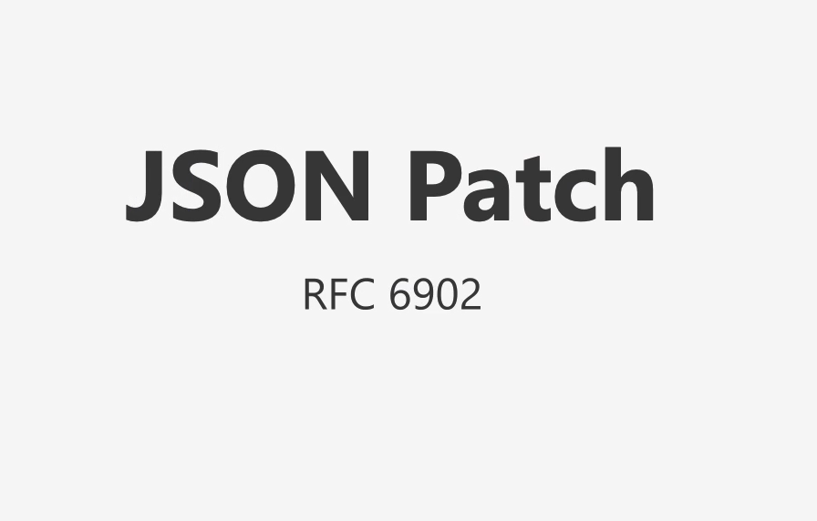
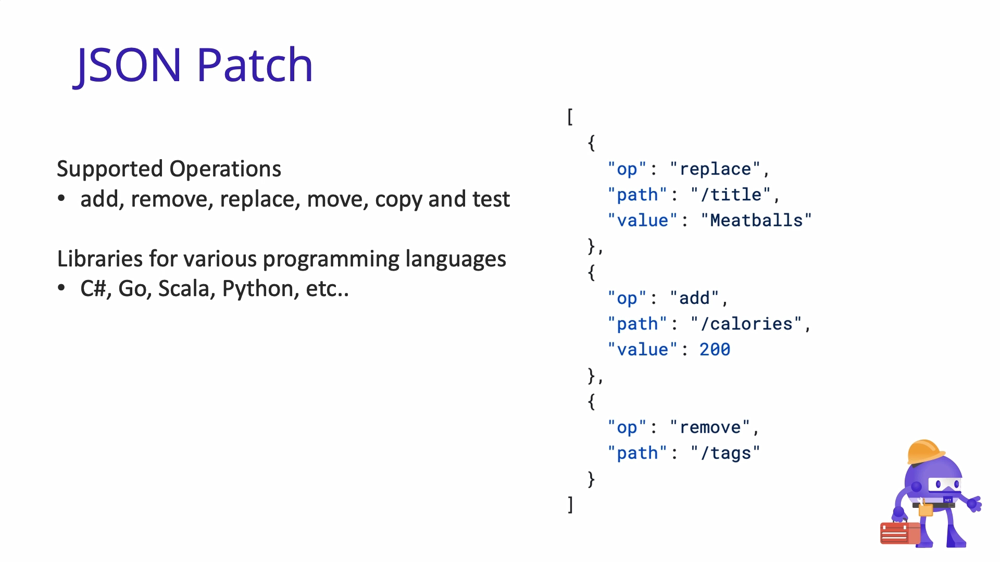
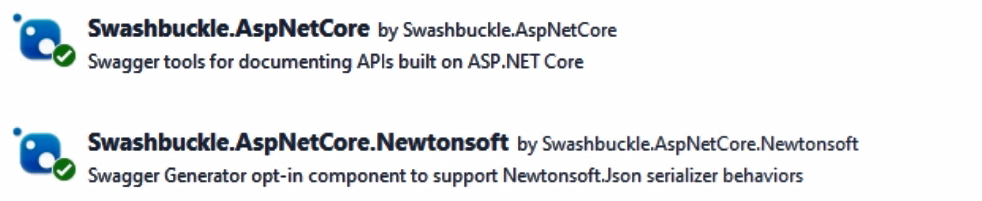

# Updating data with JsonPatch

> 使用 `JsonPatch` 进行数据更新

更新资源时使用的有两种 HTTP 方法，被称为 **Put** 和 **Patch**。

使用 **Put**，通过替换整个资源来发布更新

但是有了 **Patch**，我们可以更新给定资源内的各个属性。

> [!NOTE]
>
> 这意味着对于 **Put** 请求，我们通常必须包含消息正文中的整个资源. 但是对于 **Patch**，我们只需要定义各个属性和相关的更新操作。

## JsonPatch的规范



JSON Patches 的规范定义了我们如何对我们的 Web API 内的资源发布更新，它在规范 RFC 6902 中定义。



> [!TIP]
>
> 如果我们想在 ASP.NET Core 中实现 **JsonPatch**，我们只需要安装几个 NuGet 包。

### 安装 NuGet 包

1. 安装 **Microsoft.AspNetCore.JsonPatch** 包。
   
2. 安装 **Microsoft.AspNetCore.Mvc.NewtonsoftJson** 包
   
3. 安装 **Swashbuckle.AspNetCore.Newtonsoft** 包。
   > 我们需要它来确保JSON Patch 支持在我们的 Swagger UI 中工作。
   

然后我们再对 **program.cs** 文件进行修改
添加以下语句

```csharp
builder.Services.AddSwaggerGenNewtonsoftSupport();
builder.Services.AddSwaggerGen().AddSwaggerGenNewtonsoftSupport();
```
