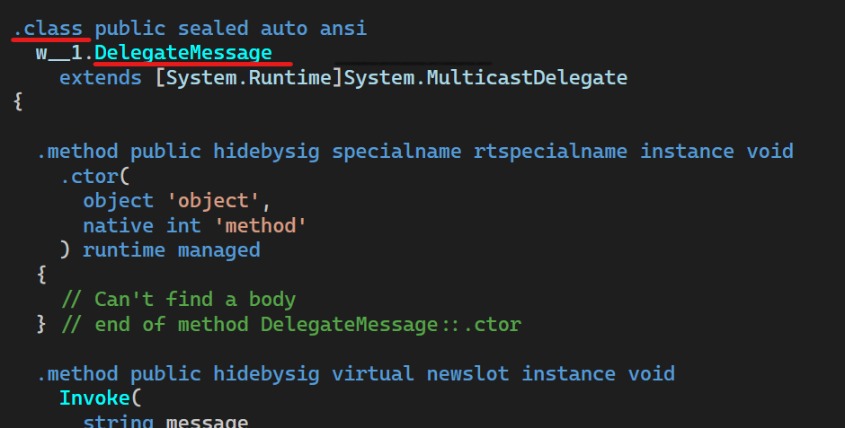

# delegate 委托

## 概述

### 委托是什么

[**`delegate` 本质上是一个类**](#delegate-解析).

委托属于 "一等公民"，即可以像类一样直接在命名空间里面直接定义。

它定义了方法的类型，使得可以将方法当作另一个方法的参数来进行传递，这种将方法动态地赋给参数的做法，可以避免在程序中大量使用If-Else(Switch)语句，同时使得程序具有更好的可扩展性。


具体原因我们可以先定义一个委托查看.

## delegate 解析

```csharp
public delegate void DelegateMessage(string message);
```

查看其 `IL` 代码, 我们可以看到 **`delegate` 是一个类**.
实际上, 在编辑器里面, delegate 和 class 的着色是相同的, 这已经是在提示 delegate 是一个类了.

可以说, 在声明 delegate 时, 就是在声明一个 class, 并且是 `sealed` 类型的 class. 这个 class 继承于 `System.MulticastDelegate`.



### delegate 的组成

delegate 由四个方法组成

1. ctor 即: 构造函数
2. Invoke
3. BeginInvoke
4. EndInvoke

### 委托的 IL 代码

```csharp
.class public sealed auto ansi
  w__1.DelegateMessage
    extends[System.Runtime]System.MulticastDelegate
{

  .method public hidebysig specialname rtspecialname instance void
    .ctor(
      object 'object',
      native int 'method'
    ) runtime managed
{
    // Can't find a body
} // end of method DelegateMessage::.ctor

  .method public hidebysig virtual newslot instance void
    Invoke(
      string message
    ) runtime managed
{
    .custom instance void System.Runtime.CompilerServices.NullableContextAttribute::.ctor([in]
    unsigned int8)
      = (01 00 01 00 00 ) // .....
      // unsigned int8(1) // 0x01
    // Can't find a body
  } // end of method DelegateMessage::Invoke

  .method public hidebysig virtual newslot instance class [System.Runtime]
System.IAsyncResult
    BeginInvoke(
      string message,
      class [System.Runtime]
System.AsyncCallback callback,
      object 'object'
    ) runtime managed
{
    .param [1]
      .custom instance void System.Runtime.CompilerServices.NullableAttribute::.ctor([in]
    unsigned int8)
        = (01 00 01 00 00 ) // .....
        // unsigned int8(1) // 0x01
    // Can't find a body
  } // end of method DelegateMessage::BeginInvoke

  .method public hidebysig virtual newslot instance void
    EndInvoke(
      class [System.Runtime]
System.IAsyncResult result
    ) runtime managed
{
    // Can't find a body
} // end of method DelegateMessage::EndInvoke
} // end of class w__1.DelegateMessage
```
