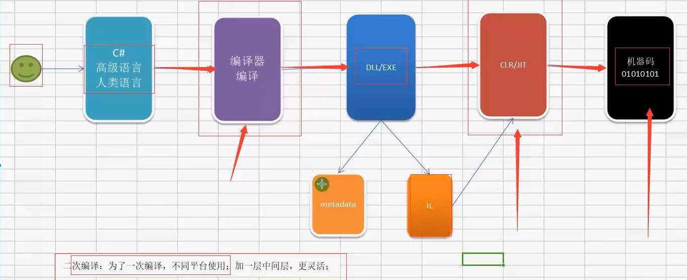

# 反射概念

> 参考: <https://www.bilibili.com/video/BV1G3411B7V3?p=3&vd_source=ba7aeec0a4474949ada521a277e9ff51>

其本质是 dotnet 中的一个帮助类库

我们程序编译成 dll/exe 后会有一个 metadata.
metadata 记录了 dll/exe 中的类, 命名空间等等
我们的 JIT 打开他时会先读取 metadata 查看, 确认 dll/exe 中的内容再进行打开.

反射就是读取的 metadata, 然后使用 metadata 指示的方法.

> [!TIP]
>
> dotnet 的运行顺序
>
> C# 编写 -> 编译 -> dll/exe -> CLR/JIT( dotnet 程序有二次编译, 双击`exe`运行需要依赖 dotnet runtime, 即: [CLR](https://learn.microsoft.com/zh-cn/dotnet/standard/clr))

> [!NOTE]
>
> JIT 是即时编译器, 其会将 dotnet 的 exe/dll 转换成二进制机器码. dotnet程序是需要二次编译的.

有人会写一个方法库编译为 .dll 文件给各个程序使用
反射就可以用来提取 .dll 文件里面的方法
一般像 java、c# 这一类使用虚拟机进行编译的语言都有这种特性

但是【反射】却被人利用，导致java、c#等类型的语言极易被反编译出源码。

## 反射可以做什么

1. 动态地创建和调用类型、方法、字段和属性
2. 检查程序集及其元数据

可以使用反射来动态地创建和调用类型、方法、字段和属性。你也
可以使用反射检查程序集及其元数据。
