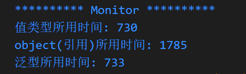

# 泛型

> 泛型在 .NET Framework 2.0 中首次引入，它本质上是一个“代码模板”，
可让开发者定义类型安全数据结构，无需处理实际数据类型。 
例如，List<T> 是一个可以声明的泛型集合，可与 List<int>、List<string> 或 List<Person> 等任何类型结合使用。
> https://docs.microsoft.com/zh-cn/dotnet/standard/generics

### 泛型类型

- 泛型例子

  ```csharp

  static void Show<T>(T value)
  {
  Console.WriteLine($"{typeof(Program)} + {value.GetType().Name}" + value.ToString());
  }
  ```

  上诉例子我们可以用 object 类型来实现同一个效果

  ```csharp

  static void objShow(object value)
  {
  Console.WriteLine($"{typeof(Program)} + {value.GetType().Name}" + value.ToString());
  }
  ```

## **可是为什么我们还要用泛型呢？**

---

这是因为我们在传输一个 int 类型给 objShow 方法时, objShow 方法的参数类型是 object, 而不是 int。

可是 object 类型的参数是引用类型，它存在于堆内存中，而 int 类型的参数是值类型，它存在于栈内存中。

也就是说我们在传递数据的时候, 程序需要**装箱**, 即将传入的数据复制到堆内存中, 再将复制后的数据传递给方法。
而方法在使用的时候, 程序又需要**拆箱**, 即将方法中的数据从堆内存中拷贝到栈内存中, 再将拷贝后的数据传递给调用者。

做这种拆箱拆箱的操作, 是会有性能损失的, 因为每次拆箱拆箱都会消耗一定的时间。

而泛型和 object 类型不同. 泛型是延迟声明的, 参数类型延迟到了调用时才确定, 并没有写死类型。 
而 object 类型是在编译时就确定的, 它把参数类型确定下来了。

> 有一种思想: **延迟一切可以延迟的**

泛型是需要编译器支持 + JIT 支持的

## 对比**泛型**、**object** 和 **值类型** 的运行速度

```csharp
using System.Diagnostics;
namespace 泛型
{
    public class Monitor
    {
        public static void ShowCompareRunTime()
        {
            System.Console.WriteLine("********** Monitor **********");
            int iValue = 123;
            long commonSecond = 0;
            long objectSecond = 0;
            long genericSecond = 0;

            // 对比执行时间

            // int类型
            {
                Stopwatch watch = new();
                watch.Start();
                // 执行3亿次
                for (var i = 0; i < 300_000_000; i++)
                {
                    ShowInt(iValue);
                }
                watch.Stop();
                commonSecond = watch.ElapsedMilliseconds;
                System.Console.WriteLine($"值类型所用时间: {commonSecond}");
            }
            // object类型
            {
                Stopwatch watch = new();
                watch.Start();
                // 执行3亿次
                for (var i = 0; i < 300_000_000; i++)
                {
                    objShow(iValue);
                }
                watch.Stop();
                objectSecond = watch.ElapsedMilliseconds;
                System.Console.WriteLine($"object(引用)所用时间: {objectSecond}");
            }
            // 泛型
            {
                Stopwatch watch = new();
                watch.Start();
                // 执行3亿次
                for (var i = 0; i < 300_000_000; i++)
                {
                    // Show<int>(iValue);
                    Show(iValue);// 泛型甚至可以不需要显示指定类型, 即添加尖括号, 鼠标移动到方法上面会显示推断出来的类型
                }
                watch.Stop();
                genericSecond = watch.ElapsedMilliseconds;
                System.Console.WriteLine($"泛型所用时间: {genericSecond}");
            }
        }

        private static void Show<T>(T iValue)
        {
            // do nothing
        }

        private static void objShow(object iValue)
        {
            // do nothing
        }

        private static void ShowInt(int iValue)
        {
            // do nothing
        }
    }
}
```

---

- 运行结果如下:
  

  可以观察到, **泛型**运行的时间与**值类型**运行的时间是**相差无几**的。

  `泛型`≈`值类型`>`object`
