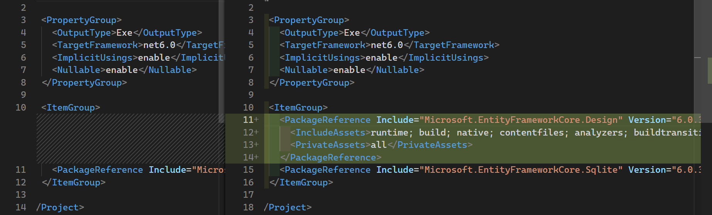

# `migration` 迁移

## [迁移概述](https://docs.microsoft.com/zh-cn/ef/core/managing-schemas/migrations/?tabs=dotnet-core-cli)

> 在实际项目中，数据模型随着功能的实现而变化：
添加和删除新的实体或属性，并且需要相应地更改数据库架构，使其与应用程序保持同步。 
EF Core 中的迁移功能能够以递增方式更新数据库架构，使其与应用程序的数据模型保持同步，
同时保留数据库中的现有数据。

> 简要地说，迁移的方式如下：

> - 当引入数据模型更改时，开发人员使用 EF Core 工具添加相应的迁移，以描述使数据库架构保持同步所需的更新。
EF Core 将当前模型与旧模型的快照进行比较，以确定差异，并生成迁移源文件；
文件可在项目的源代码管理中进行跟踪，如任何其他源文件。

> - 生成新的迁移后，可通过多种方式将其应用于数据库。 
EF Core 在一个特殊的历史记录表中记录所有应用的迁移，使其知道哪些迁移已应用，哪些迁移尚未应用。

> https://docs.microsoft.com/zh-cn/ef/core/managing-schemas/migrations/?tabs=dotnet-core-cli

### 迁移是什么?

迁移允许我们从一组 csharp 类创建数据库, 而随着模型的发展, 我们将**模型与数据库保持同步**称之为**迁移**。

---

## 查看 EF Core 体系结构


### 两种使用[EF Core](https://docs.microsoft.com/zh-cn/ef/core/)的方式

> [Entity Framework Core 工具参考](https://docs.microsoft.com/zh-cn/ef/core/cli/)

1. 我们可以通过数据库生成模型, 这种方式被称为**数据库优先**。
   
2. 或者你先建立一个 C#`model`类, 然后再使用 EF Core 工具生成数据库, 这种方式被称为**代码优先**。
   

**EF CORE** 会帮助我们将**数据库架构(schema)与模型保持同步**。

## 如何使用 `迁移`

本例中将使用 `SQLite` 数据库。

为了方便使用 `SQLite`数据库, 我们将使用 `Microsoft.EntityFrameworkCore.Sqlite` 库。

> ### 安装 EF CORE 工具
>
> 请查阅 [Entity Framework Core 工具参考 - .NET Core CLI](https://docs.microsoft.com/zh-cn/ef/core/cli/dotnet)

### 添加 Nuget 包

1. 使用.NET Core CLI 命令行工具添加 Nuget 包

   1. 此命令将添加包含 EF Core Sqlite 数据库提供 程序及其所有依赖项的 NuGet 包，包括常见的 EF Core 服务。

      其有助于我们连接到数据库。

      ```.NET Core CLI
      dotnet add package Microsoft.EntityFrameworkCore.Sqlite
      ```

      执行后 .csproj 文件新增
      

   2. 此命令添加 EF Core 工具所需的包

      ```.NET Core CLI
      dotnet add package Microsoft.EntityFrameworkCore.Design
      ```

      执行后 .csproj 文件新增
      

2. 我们也可以在 visual studio 2022 中使用 Nuget 包管理工具进行下载。

   > 注：在 vs 还需要安装 Microsoft.EntityFrameworkCore.Tools

   > 这个包允许我们从 vs 的 Nuget 包管理窗口运行迁移。

   

## 创建迁移

为了和实体框架一起工作,我们需要创建一个 `model`。

---

# 笔记参考

> [How to Use Entity Framework Core Code First Migrations](https://youtu.be/W9yVjry3VSQ)
