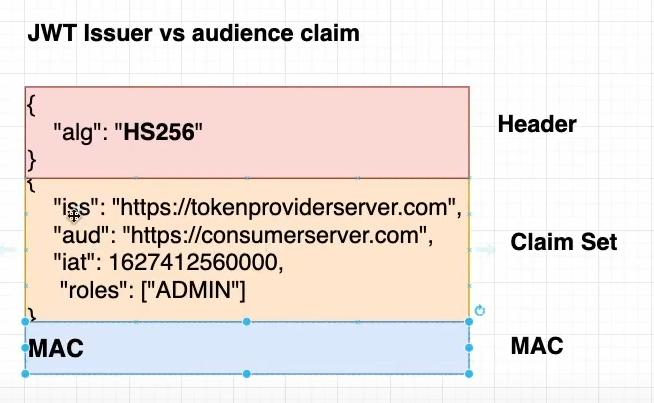

# JWT

## 前言

> JWS只是JWT的一种实现，除了JWS外，JWE(JSON Web Encryption)也是JWT的一种实现.

> [!TIP]
> JWT只是为了授权, 而不是为了身份认证. 其只是授予访问特定系统的权限

## JWT的组成

其分为三部分, `HEADER`, `PAYLOAD` 和 `VERIFY SigNature`

### Header

主要声明了JWT的签名算法

有些会指定 token 的类型, 如:

```json
{
    "alg": "HMacSha256",
    "typ": "JWT" // 表示 token 类型
}
```

具体参数设置可查阅
[RFC 7516 - JSON Web Encryption (JWE)](https://datatracker.ietf.org/doc/html/rfc7516#section-4)

### Payload

主要承载了各种声明并传递明文数据.

即: 比如表单中填写的各种信息, 在 C# 常以 Claims 表示.

#### issuer

JWT token issuer 是“创建”令牌并使用其私钥签署令牌的一方。
即: token的创建者
任何人都可以创建token，确保你收到的token是由你信任的一方创建的。
在其中内容的URL代表着创建token的服务器id

issuer参考文档:
> [kubernetes - What is a JWT Issuer? - Stack Overflow](https://stackoverflow.com/questions/68818485/what-is-a-jwt-issuer#:~:text=JWT%20token%20issuer%20%2D%20is%20the,a%20party%20that%20you%20trust.)

#### Audience

可以理解为指定token适用的网站. 或者说 token 的接收人
比如一个服务器可以有很多个网站, 而如果不指定aud, 那么可能会被人用A站点的token去验证B站点.

> “aud”(Audience 受众)声明确定了JWT所针对的收件人。意图处理JWT的每个主体必须在受众声明(claims)中标识自己的值。如果处理 claim 的主体在该claim 出现时没有将自己与“aud”claim 中的值相匹配，则JWT必须被拒绝。在一般情况下，“aud”值是一个区分大小写的字符串数组，每个字符串包含一个tringOrURI值。在特殊情况下，当JWT只有一个受众时，“aud”值可以是一个区分大小写的字符串，包含一个StringOrURI值。受众的值的解释通常是具体应用的。使用此声明是可选的。

Audience参考文档:
> [JWT: Why is audience important? - Information Security Stack Exchange](https://security.stackexchange.com/questions/209318/jwt-why-is-audience-important)
>
> [oauth - JWT (Json Web Token) Audience "aud" versus Client_Id - What's the difference? - Stack Overflow](https://stackoverflow.com/questions/28418360/jwt-json-web-token-audience-aud-versus-client-id-whats-the-difference#:~:text=The%20audience%20aud%20claim%20in,as%20https%3A%2F%2Fcontoso.com%20.)
>
> [RFC 7519: JSON Web Token (JWT) (rfc-editor.org)](https://www.rfc-editor.org/rfc/rfc7519#section-4.1.3)

### VERIFY SigNature

其主要是
拥有该部分的 `JWT` 被称为 `JWS`, 也就是签了名的 `JWS`;

没有该部分的JWT被称为nonsecure JWT 也就是不安全的JWT，此时header中声明的签名算法为none

----------

以下为 JWT 结构的参考




JWS 结构


参考文档:
> <https://www.cnblogs.com/-wenli/p/13205295.html>
>
> <https://youtu.be/uZlQsBBI5eQ?list=PL1Nml43UBm6ctQsHH6eSWtQmMBqRiS2mI>
>
> <https://youtu.be/7Q17ubqLfaM>
