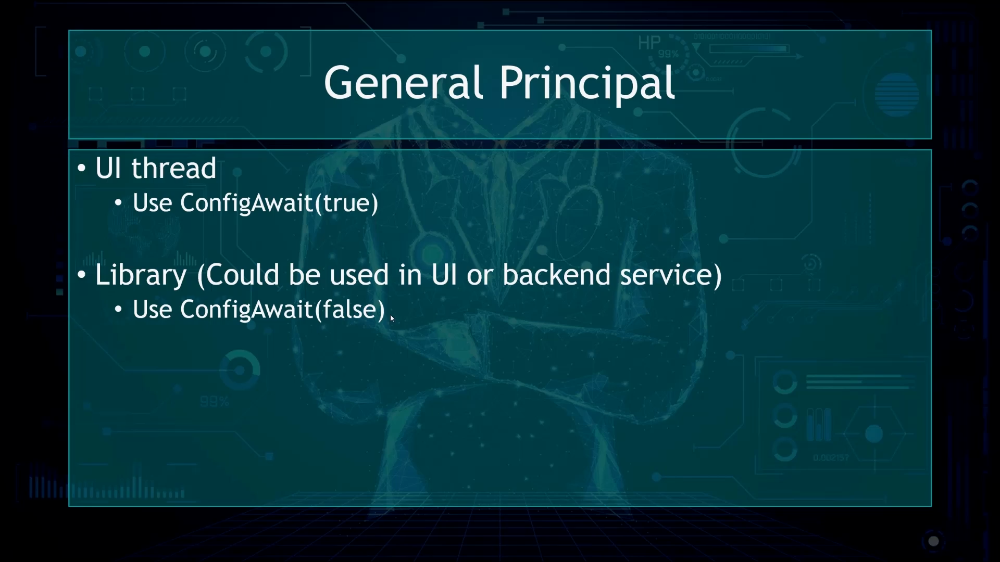

## ConfigAwait

更多参考:

- <https://www.youtube.com/watch?v=avhLfcgIwbg>
- <https://learn.microsoft.com/en-us/dotnet/api/system.threading.tasks.task.configureawait?view=net-7.0>
- <https://www.youtube.com/watch?v=5d6YoHuSvoI>

```csharp
public System.Runtime.CompilerServices.ConfiguredTaskAwaitable ConfigureAwait (bool continueOnCapturedContext);
```

### 作用

接收一个 `continueOnCapturedContext` 的传参. 如果**传参**值 = true, 将使 `continuation` 返回原始线程执行. 否则(即**传参**值 = false), 使用随机线程执行.

```typescript
// 原注释
Parameters
continueOnCapturedContext
Boolean
true to attempt to marshal the continuation back to the original context captured; otherwise, false.

Returns
ConfiguredTaskAwaitable
An object used to await this task.
```

### 使用

你如果只是想做一些程序后端的开发, 你大部分时候并不会在乎, 你的部分是否一定要返回到初始的线程的去执行.

那么 这个时候呢 你可能, 就可以在这加 `ConfigureAwait(false)` 告诉编译器. 我并不在乎一定要返回初始的Thread, 你可以帮我从 ThreadPool 中找到一个当前可用的 Thread, 去执行 After await 的部分.

> [!TIP]
>
> 如果我们的程序是Library, 这个 Library 是既可以被 UI程序使用, 也可以被后端使用的 Library. 那么 Library中所有的异步 await 的方法, 最好都被设置为 ConfigAwait 为 false.
>
> 很多Library并不太在乎 continuation 的部分是被**原始**的 Thread 执行还是被**任意**的 Thread 执行.
> 那么如果从 ThreadPool 找任意的 Thread 反而会带来更好的性能

> [!NOTE]
>
> windowsApplication 中由于涉及到了一的部分 UI, 所以程序会默认把所有的位置 ConfigAwait 设为的成为 true. 那么这时候你即使不去配置, 这个程序也会做对 UI Thread 做的最为友好的一个配置

```csharp
async Task MyMethodAsync()
{
    // Before await
    await RunSomethingAsync().ConfigureAwait(false);
    // After await
}
```

### ConfigAwait的使用场景


