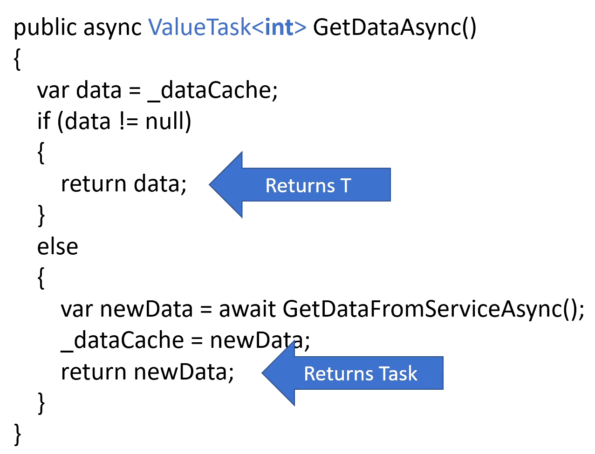
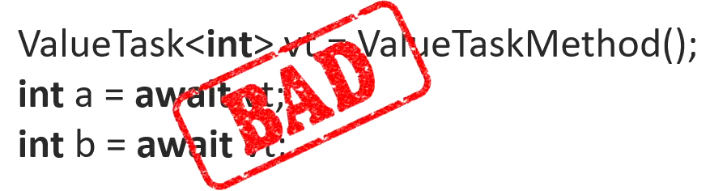
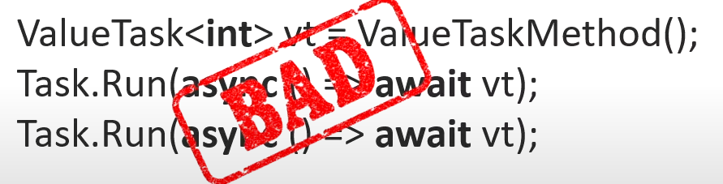
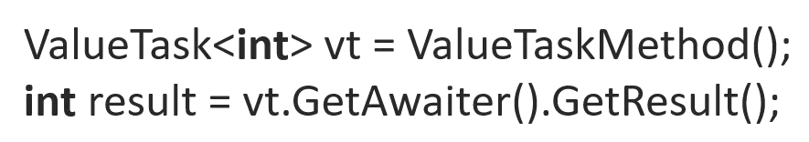

# ValueTask

更多参考:

- <https://learn.microsoft.com/en-us/dotnet/api/system.threading.tasks.valuetask-1?view=net-7.0>
- <https://www.youtube.com/watch?v=IN4dRdKlISI>
- <https://youtu.be/dCj7-KvaIJ0?list=RDCMUCC78lt3WRH0bROwiIvw847g>

`ValueTask` 是一个值类型, 其本质上是一个结构体, 其包含了一个 `Task<TResult>` 和一个 `TResult`, 只有其中一种会被使用到.

## 使用场景

使用 `ValueTask` 是一个非常具体的场景, 即: 方法何时可以进行同步或者异步返回一个值.

一个 `ValueTask<TResult>` 实例只能等待一次

> 例子:

从代码中可观察到, 该异步方法有两种形式. 只需同步执行便返回的 `dataCache`, 和进行异步的**取数据**

> [!TIP]
>
> 同步执行的 `cache` 也被称为 **HOT PATH**. 因为其是最有可能被采用的. 因为数据已经在内存里的可能性非常高.
>
> 如果没有 cache, 便采用异步去进行 IO 操作

> 完整代码查看: E:\a2230\Documents\projects\.NET Core\Y-异步async await\Task详细\ValueTask初识

```csharp
public async Task<int[]> GetDataAsync()
{
    var data = _dataCache;// 一般内存会有一些 cache, 便不需要进行数据库查询
    if (data != null)
    {
        return data;// return cache, 不需要异步
    }
    var newData = await GetDataServiceAsync();
    _dataCache = newData;
    return newData;
}
```

> [!NOTE]
>
> 综上, 该程序无论在什么时候都会返回一个 `Task` 对象. 因为其函数返回值是 `Task<T>`.
>
> ⭐所以其无论是什么值, 都会被放到**内存堆**上进行返回.

### 使用 ValueTask 优化

将返回值改为 `ValueTask<T>` 即可.
> [!TIP]
>
> ⭐`ValueTask` 会在 未使用异步方法时/只使用同步代码块时(HotPath), 会只实例化 **泛型 T**, 在其遇上 await 进行异步方法调用后会实例化成 `Task<T>`.
>
> 如此, 我们便可以有效的利用内存, 不需要每次都在堆上分配内存.

> [!TIP]
>
> 申请效率的比较：
>
> 栈由系统**自动分配**，速度**较快**。但程序员是无法控制的。
>
> 堆是由new分配的内存，一般速度比**较慢**，而且容易产生内存碎片,不过用起来最方便。
>
> [堆栈参考](https://www.zhihu.com/question/31074024)

```csharp
public async ValueTask<int[]> GetDataWithValueTaskAsync()
{
    var data = _dataCache;
    if (data != null)
    {
        return data;
    }
    var newData = await GetDataServiceAsync();
    _dataCache = newData;
    return newData;
}
```



## 使用限制

1. 不可以多次 await 同一个 `ValueTask`. 因为底层对象可能已经被回收了, 或者被其他 操作/线程 使用.



2. 不可多次运行.



3. 不可使用阻塞. 因为你不知道其何时完成. 无论在任何时候, 将 Task 的返回值存储到变量中, 使用**阻塞等待**都是一件很愚蠢的事.


